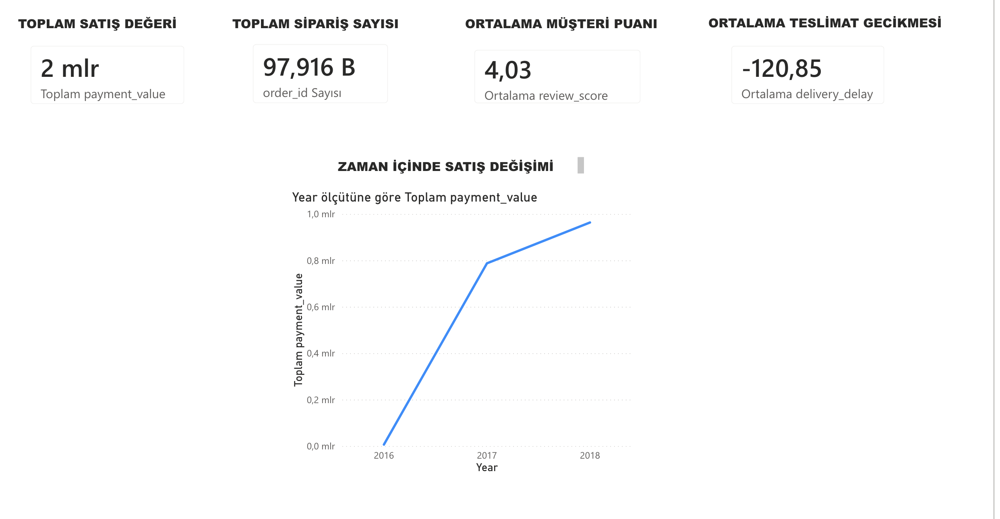

# ecommerce-data-analysis
E-commerce data analysis and Power BI dashboard project
# E-Commerce Data Analysis & Dashboard

## Project Overview
This project analyzes an e-commerce dataset to uncover insights about sales trends, customer satisfaction, and delivery performance.

## Technologies Used
- Python (Pandas, Matplotlib)
- Power BI
- Google Colab

## Dashboard Preview

## Key Insights
- Sales show an upward trend over time
- Customer satisfaction is generally high (~4.0)
- Delivery delays can impact customer reviews
- Some product categories generate more revenue
